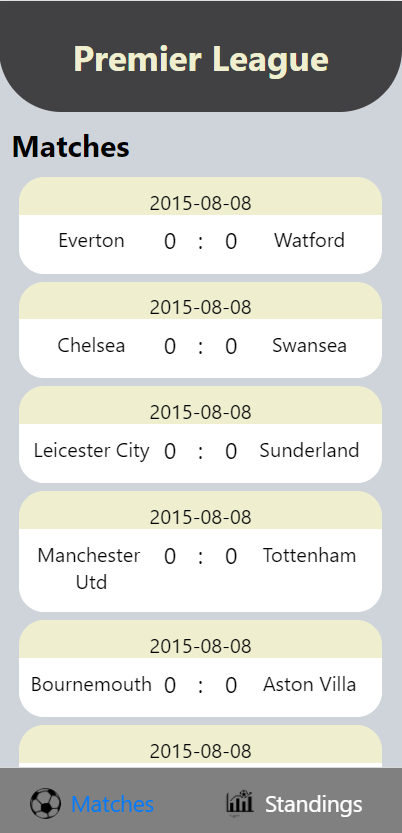
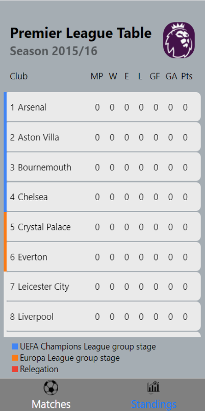

# Premier-league-simulation-app

## How it works
Execute the App.js class. Afterwards, run index.js and publisher.js classes in ./Backend/Rabbitmq.

## About
The application reads data from file which have scores, team names and date of matches. After it calculates the score of each matches and standings and it saves data to database and sends data to the frontend using socket io.

## Some photos

